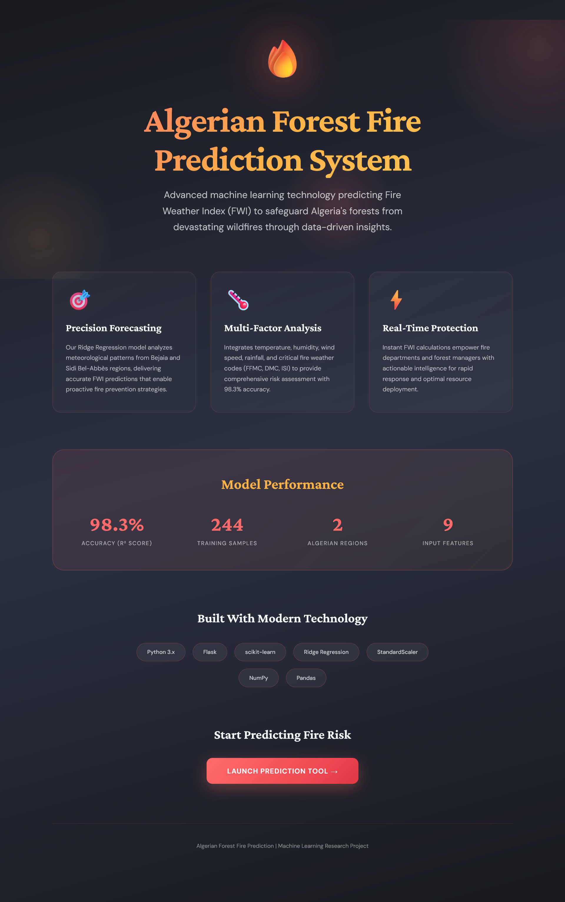
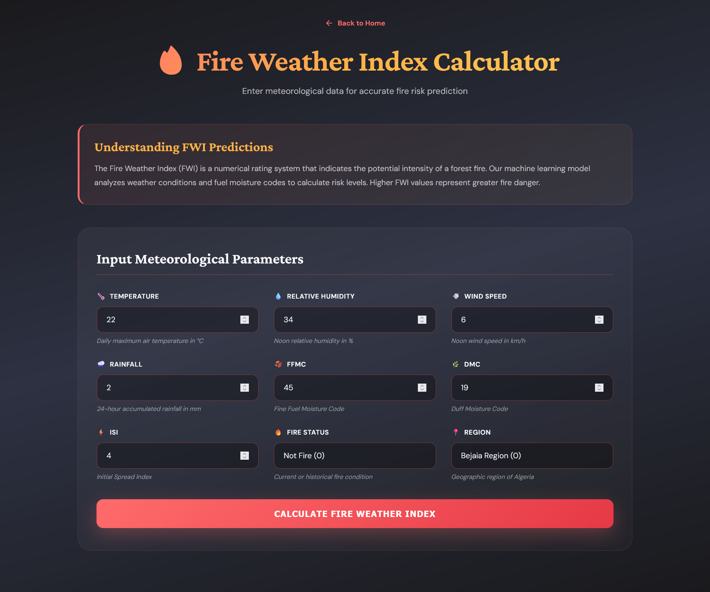
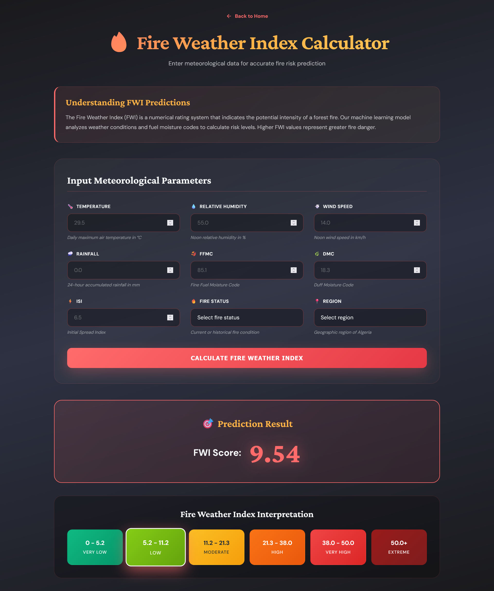
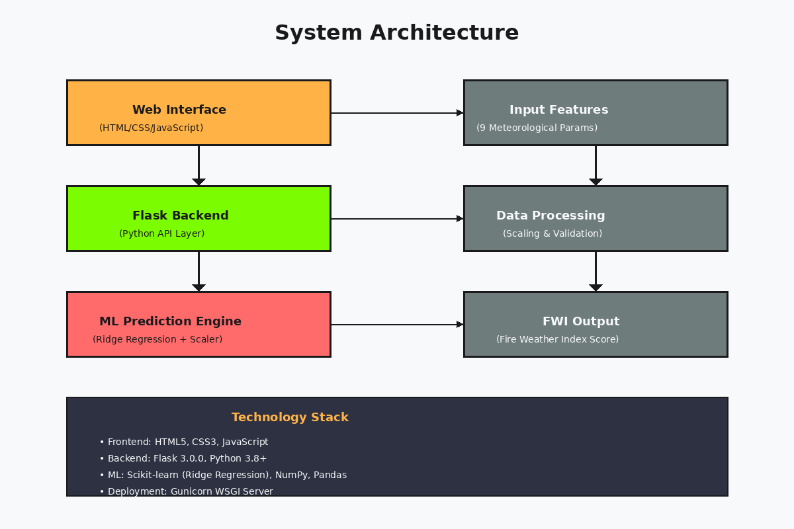

# 🔥 Algerian Forest Fire Prediction System

A machine learning-powered web application that predicts the Fire Weather Index (FWI) for forest fire risk assessment in Algeria using meteorological and environmental data.

## 📋 Table of Contents

- [Overview]
- [Features]
- [Dataset]
- [Model]
- [Installation]
- [Usage]
- [Project Structure]
- [API Endpoints]
- [Input Parameters]
- [Technologies Used]
- [Screenshots]
- [Future Improvements]
- [Contributing]
- [License]

## 🌟 Overview

Forest fires pose a significant threat to ecosystems, wildlife, and human settlements. This project leverages machine learning to predict the Fire Weather Index (FWI), a critical metric used by fire management agencies to assess fire danger levels. By analyzing meteorological and environmental factors, the system provides real-time predictions to aid in fire prevention and resource allocation.

### What is FWI?

The Fire Weather Index (FWI) is a numeric rating of fire intensity. It combines various factors including temperature, humidity, wind speed, and rainfall to produce a comprehensive fire danger rating. Higher FWI values indicate greater fire danger.

## ✨ Features

- **Real-time FWI Prediction**: Instant fire weather index predictions based on current conditions
- **User-Friendly Interface**: Clean, responsive web interface with modern design
- **Input Validation**: Comprehensive validation of all input parameters
- **Model Performance**: Ridge Regression model with optimized hyperparameters
- **RESTful API**: Health check endpoint for monitoring system status
- **Error Handling**: Robust error handling and logging system
- **Responsive Design**: Works seamlessly on desktop and mobile devices

## 📊 Dataset

The project uses the **Algerian Forest Fires Dataset**, which contains meteorological observations from two regions in Algeria:

- **Bejaia Region** (Northeast Algeria)
- **Sidi Bel-abbes Region** (Northwest Algeria)

### Dataset Features:

| Feature | Description | Range |
|---------|-------------|-------|
| **Temperature** | Temperature in Celsius | 0-60°C |
| **RH** | Relative Humidity | 0-100% |
| **Ws** | Wind Speed | 0-200 km/h |
| **Rain** | Rainfall | 0-500 mm |
| **FFMC** | Fine Fuel Moisture Code | 0-101 |
| **DMC** | Duff Moisture Code | 0-500 |
| **ISI** | Initial Spread Index | 0-100 |
| **Classes** | Fire/No Fire (0=No Fire, 1=Fire) | 0-1 |
| **Region** | Geographic Region (0=Bejaia, 1=Sidi Bel-abbes) | 0-1 |

**Target Variable**: FWI (Fire Weather Index)

## 🤖 Model

### Algorithm: Ridge Regression

Ridge Regression was selected after evaluating multiple regression algorithms due to its:
- Excellent performance on the dataset
- Ability to handle multicollinearity
- Regularization to prevent overfitting
- Stable predictions

### Model Pipeline:

1. **Data Preprocessing**:
   - Feature scaling using StandardScaler
   - Handling of categorical variables
   - Data cleaning and validation

2. **Model Training**:
   - Ridge Regression with optimized alpha parameter
   - Cross-validation for hyperparameter tuning
   - Train-test split for evaluation

3. **Model Persistence**:
   - Models saved as pickle files (`ridge.pkl`, `scaler.pkl`)
   - Easy deployment and version control

### Performance Metrics:

- Model evaluation metrics are available in the `Model_Training.ipynb` notebook
- Comprehensive analysis including R², MAE, and RMSE

## 🚀 Installation

### Prerequisites

- Python 3.8 or higher
- pip (Python package manager)
- Virtual environment (recommended)

### Step-by-Step Installation

1. **Clone the repository**:
```bash
git clone https://github.com/yourusername/algerian-forest-fire-prediction.git
cd algerian-forest-fire-prediction
```

2. **Create a virtual environment**:
```bash
python -m venv venv

# On Windows
venv\Scripts\activate

# On macOS/Linux
source venv/bin/activate
```

3. **Install dependencies**:
```bash
pip install -r requirements.txt
```

4. **Set up the project structure**:
```
project/
├── application.py
├── requirements.txt
├── models/
│   ├── ridge.pkl
│   └── scaler.pkl
└── templates/
    ├── index.html
    └── home.html
```

5. **Run the application**:
```bash
python application.py
```

The application will start on `http://localhost:5000`

## 💻 Usage

### Running Locally

1. Start the Flask server:
```bash
python application.py
```

2. Open your browser and navigate to:
```
http://localhost:5000
```

3. Enter the required meteorological parameters in the prediction form

4. Click "Predict FWI" to get the fire weather index prediction

### Using the Prediction Form

1. **Navigate to the prediction page**: Click "Get Started" or "Predict Now" on the landing page
2. **Fill in the form** with the following parameters:
   - Temperature (°C)
   - Relative Humidity (%)
   - Wind Speed (km/h)
   - Rainfall (mm)
   - FFMC (Fine Fuel Moisture Code)
   - DMC (Duff Moisture Code)
   - ISI (Initial Spread Index)
   - Classes (0 for No Fire, 1 for Fire conditions)
   - Region (0 for Bejaia, 1 for Sidi Bel-abbes)
3. **Submit** the form to receive your FWI prediction

### Environment Variables (Optional)

You can configure the application using environment variables:

```bash
export FLASK_HOST=0.0.0.0
export FLASK_PORT=5000
export FLASK_DEBUG=False
export SECRET_KEY=your-secret-key-here
```

## 📁 Project Structure

```
algerian-forest-fire-prediction/
│
├── application.py                          # Main Flask application
├── requirements.txt                        # Python dependencies
├── README.md                              # Project documentation
│
├── models/                                # Trained models
│   ├── ridge.pkl                         # Ridge Regression model
│   └── scaler.pkl                        # StandardScaler for preprocessing
│
├── templates/                            # HTML templates
│   ├── index.html                        # Landing page
│   └── home.html                         # Prediction form page
│
├── notebooks/                            # Jupyter notebooks
│   ├── Algerian_Forest_Fires_Dataset.ipynb    # Data exploration
│   └── Model_Training.ipynb              # Model training and evaluation
│
└── data/                                 # Dataset files
    ├── Algerian_forest_fires_cleaned_dataset.csv
    └── Algerian_forest_fires_dataset_UPDATE.csv
```

## 🔌 API Endpoints

### 1. Home Page
- URL: /
- **Method**: `GET`
- **Description**: Landing page with project information

### 2. Prediction Page
- **URL**: `/predictdata`
- **Method**: `GET`, `POST`
- **Description**: 
  - GET: Display prediction form
  - POST: Process form data and return FWI prediction
- **Request Body** (POST):
```json
{
  "Temperature": 30,
  "RH": 50,
  "Ws": 15,
  "Rain": 0,
  "FFMC": 85,
  "DMC": 25,
  "ISI": 5,
  "Classes": 1,
  "Region": 0
}
```
- **Response**: HTML page with prediction result

### 3. Health Check
- **URL**: `/health`
- **Method**: `GET`
- **Description**: Check system status and model availability
- **Response**:
```json
{
  "status": "healthy",
  "models_loaded": true,
  "ridge_model": true,
  "scaler": true
}
```

## 📝 Input Parameters

### Required Parameters

| Parameter | Description | Type | Valid Range |
|-----------|-------------|------|-------------|
| Temperature | Air temperature in Celsius | Float | 0-60 |
| RH | Relative Humidity percentage | Float | 0-100 |
| Ws | Wind Speed in km/h | Float | 0-200 |
| Rain | Rainfall in mm | Float | 0-500 |
| FFMC | Fine Fuel Moisture Code | Float | 0-101 |
| DMC | Duff Moisture Code | Float | 0-500 |
| ISI | Initial Spread Index | Float | 0-100 |
| Classes | Fire condition (0=No Fire, 1=Fire) | Integer | 0-1 |
| Region | Geographic region (0=Bejaia, 1=Sidi Bel-abbes) | Integer | 0-1 |

### Example Input

```python
Temperature = 35.0
RH = 45.0
Ws = 20.0
Rain = 0.0
FFMC = 90.5
DMC = 30.0
ISI = 8.5
Classes = 1
Region = 0
```

## 🛠 Technologies Used

### Backend
- **Flask 3.0.0**: Web framework
- **NumPy**: Numerical computing
- **Pandas**: Data manipulation
- **Scikit-learn**: Machine learning
- **Gunicorn**: WSGI HTTP Server (for production)

### Frontend
- **HTML5**: Structure
- **CSS3**: Styling with modern gradients and animations
- **JavaScript**: Interactive elements
- **Google Fonts**: Typography (DM Sans, Crimson Pro)

### Development Tools
- **Jupyter Notebook**: Data analysis and model training
- **Pickle**: Model serialization
- **Logging**: Application monitoring

## 📸 Screenshots

### 1. Home Page
The Home page features a modern, nature-inspired design with fire-themed colors and smooth animations, providing an intuitive entry point to the application.



**Features:**
- Modern dark theme with gradient backgrounds
- Clear call-to-action buttons
- Feature highlights showcasing key capabilities
- Responsive design for all devices

### 2. Prediction Form
User-friendly form interface with clear input fields, real-time validation, and helpful placeholders for each meteorological parameter.




**Features:**
- 9 input fields for meteorological data
- Input validation with range checking
- Clear labels and placeholder examples
- Intuitive layout for easy data entry

### 3. Prediction Results
Clean results display showing the calculated Fire Weather Index with risk level interpretation and actionable insights.



**Features:**
- Large, clear FWI value display
- Risk level interpretation
- Color-coded results for quick assessment
- Option to make additional predictions

### 4. System Architecture
Overview of the application's architecture showing the flow from user input through the ML model to prediction output.



**Components:**
- Web interface layer (HTML/CSS/JS)
- Flask backend API
- ML prediction engine (Ridge Regression)
- Data processing pipeline

## 🔮 Future Improvements

- [ ] Add real-time weather API integration
- [ ] Implement user authentication and history tracking
- [ ] Create a dashboard for historical predictions
- [ ] Add map visualization of fire risk areas
- [ ] Develop a mobile application
- [ ] Implement ensemble models for improved accuracy
- [ ] Add multilingual support (French, Arabic)
- [ ] Create an alerting system for high fire risk
- [ ] Integrate satellite imagery analysis
- [ ] Add temporal forecasting (next 7 days)

## 🤝 Contributing

Contributions are welcome! Please follow these steps:

1. Fork the repository
2. Create a feature branch (`git checkout -b feature/AmazingFeature`)
3. Commit your changes (`git commit -m 'Add some AmazingFeature'`)
4. Push to the branch (`git push origin feature/AmazingFeature`)
5. Open a Pull Request

### Development Guidelines

- Follow PEP 8 style guide for Python code
- Add tests for new features
- Update documentation as needed
- Ensure all tests pass before submitting PR

## 📄 License

Distributed under the MIT License. See LICENSE for more information

## 🙏 Acknowledgments

- Algerian Forest Fire Dataset contributors
- Flask and Scikit-learn communities
- Open source contributors

## 📧 Contact

For questions or feedback, please reach out:

- Email: pinkidagar18@gmail.com
---

**Note**: This project is for educational and research purposes. Always consult professional fire management agencies for actual fire risk assessments.

## 📚 References

- [Fire Weather Index System](https://cwfis.cfs.nrcan.gc.ca/background/summary/fwi)
- [Scikit-learn Documentation](https://scikit-learn.org/)
- [Flask Documentation](https://flask.palletsprojects.com/)

---

Made with ❤️ for forest conservation and fire prevention


